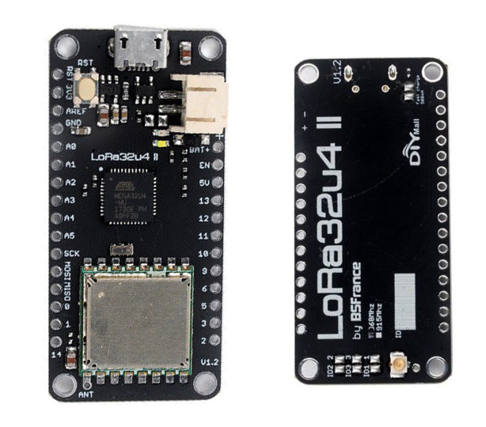
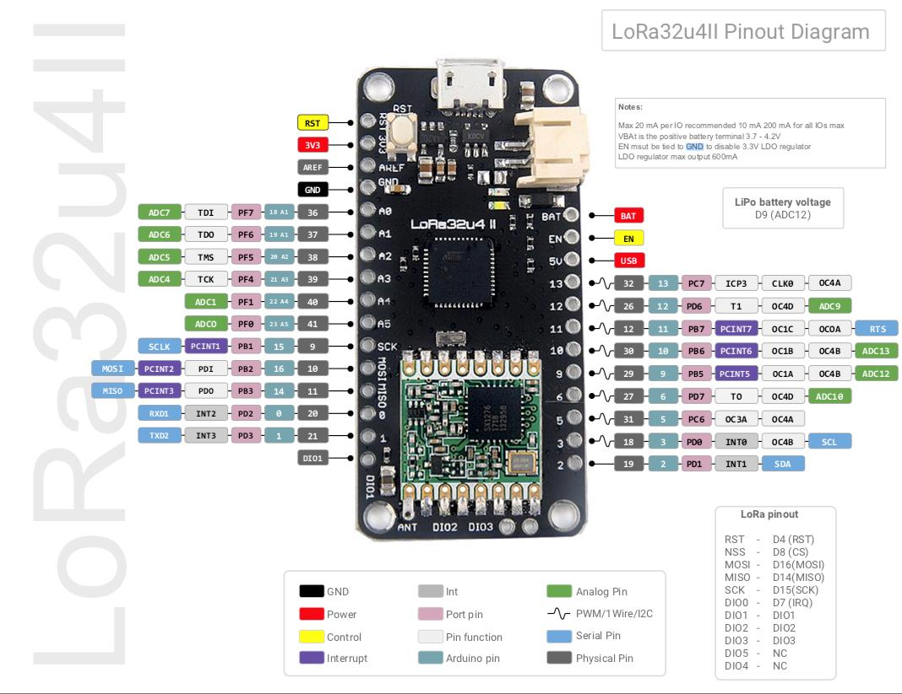

# Software for Real-Time and Embedded Systems (SoRTES)
## Labs
- Session 1: Intro to Embedded Systems
- Session 2: Intro to LoRa
- Session 3: FreeRTOS and Low Power Modes

## Project
- SoRTES Project: Time-Synchronized Embedded Device
- Deadline: **Monday 7 December 2020, 09:00**

## Schedule
- Week of 28-09-2020: Introduction, Computation
- Week of 05-10-2020: Memory
- Week of 12-10-2020: \
- Week of 19-10-2020: IO, Lab Session 1
- Week of 26-10-2020: \
- Week of 02-11-2020: Time, Lab Session 2, Project Assignment
- Week of 09-11-2020: Energy, Lab Session 3
- Week of 16-11-2020: Programming
- Week of 23-11-2020: \
- Week of 30-11-2020: OS, FreeRTOS
- Week of 07-12-2020: Scheduling, Project Evaluation

## LoRa32u4 II 868MHz LoRa development board v1.2




### Install board library for Arduino IDE
The library can be found [here](https://github.com/BSFrance/BSFrance-avr).

```bash
cd ~/Arduino/hardware
git clone https://github.com/BSFrance/BSFrance-avr
```

### Install LoRa library for Arduino IDE
LoRa RF module can be programmed using the [Arduino LoRa library](https://github.com/sandeepmistry/arduino-LoRa).

```bash
cd ~/Arduino/libraries
git clone https://github.com/sandeepmistry/arduino-LoRa
```

