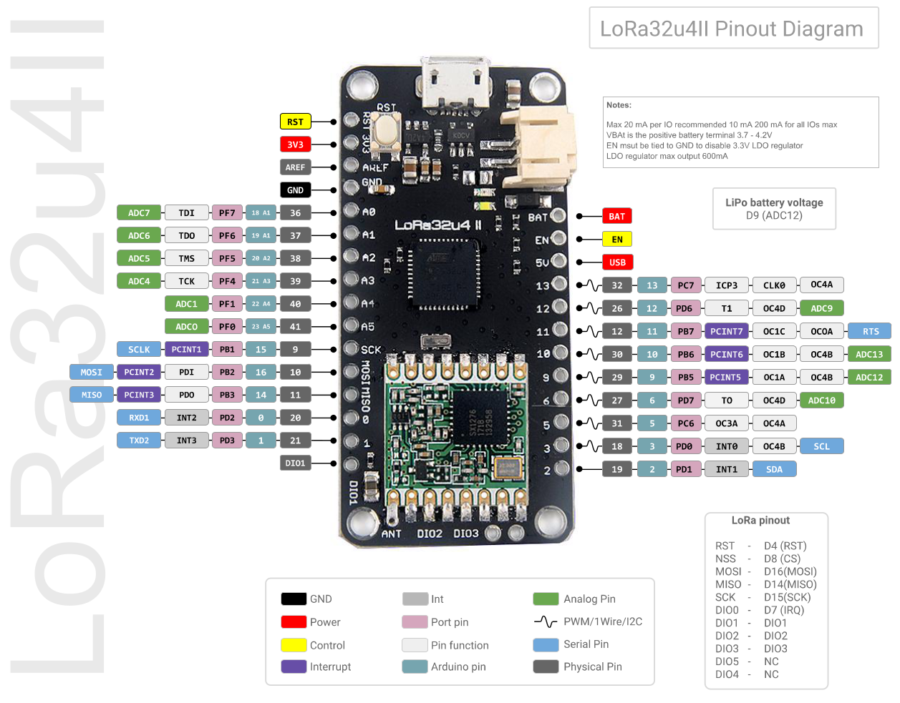

# Software for Real-Time and Embedded Systems (SoRTES)
## Labs
- Session 1: Intro to Embedded Systems
- Session 2: Intro to LoRa

## Schedule
- Week of 28-09-2020: Introduction, Computation
- Week of 05-10-2020: Memory
- Week of 12-10-2020: -
- Week of 19-10-2020: IO, Practical Assignment 1
- Week of 26-10-2020:
- Week of 09-11-2020:
- Week of 16-11-2020:
- Week of 23-11-2020:
- Week of 30-11-2020:
- Week of 04-12-2020:
- Week of 11-12-2020:

---

- Week of ?: Programming
- Week of ?: Practical Assignment 2
- Week of ?: Practical Assignment 3
- Week of ?: Time
- Week of ?: OS
- Week of ?: Practical Assignment 4
- Week of ? : Free RTOS
- Week of ? : Practical Assignment 5
- Week of ? : Scheduling
- Week of ? : Practical Assignment 6

## LoRa32u4 II 868MHz LoRa development board




### Install board library for Arduino IDE
The library can be found [here](https://github.com/BSFrance/BSFrance-avr).

```bash
cd ~/Arduino/hardware
git clone https://github.com/BSFrance/BSFrance-avr
```

### Install LoRa library for Arduino IDE
LoRa RF module can be programmed using the [Arduino LoRa library](https://github.com/sandeepmistry/arduino-LoRa).

```bash
cd ~/Arduino/libraries
git clone https://github.com/sandeepmistry/arduino-LoRa
```

